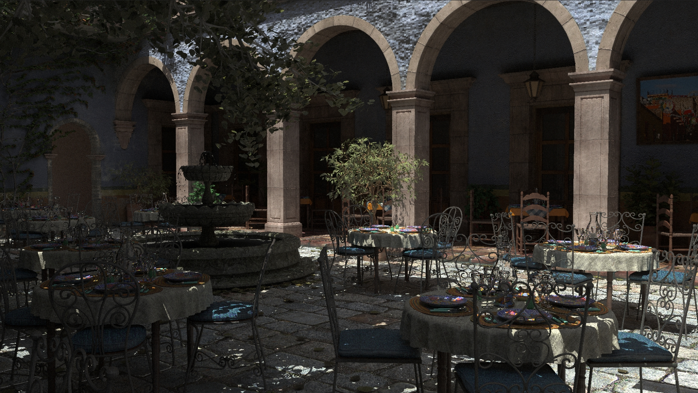
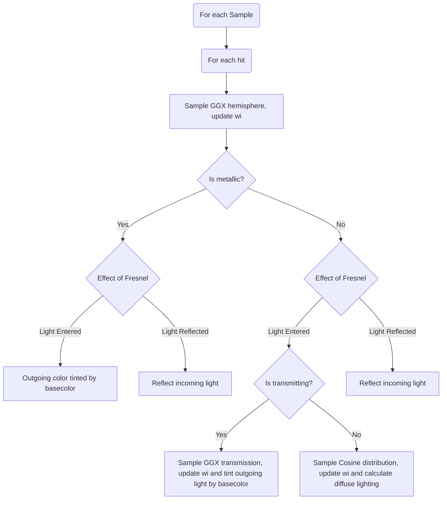

## Material behaviour

This algorithm tries to follow this path of incoming light for the different material input and calculates the outgoing color.

The treatment of the material inputs and the calculations of certain fator change based on whether the material is metallic or dielectric. 

The fresnel is calculated differently for metallic and dielectrics. It decides how much light enters the object and how much light is reflected back as it is.

Metals cannot absorb the light, so all of it reflected after being tinted by the base color. 

Dielectrics absorb the light, and based on the tranmission factor, transmit the light through their interior or diffuse it back out.

## Flow

We take advantage of the multiple samples processed per pixel, and calculate the light color as if the object was fully metal, or fully dielectric, fully transmissive of fully diffuse.

For `N` samples the object will take on the absolute properties close to the value of the input. e.g. for metalness value of `0.5` the object will be fully metallic for `0.5 * N` runs, and dielectric for the rest.

So for each sample we draw a uniform random number between `0` and `1`, for each of the inputs that we are considering. The material is fully transmissive if transmission value is greater than random number drawn. Similar check is performed for the other inputs.

## Algorithm

```
for each sample
    for each hit on a triangle

        wi = sample_ggx_hemisphere()
        is_metallic = random_number(0, 1)
        
        if (is_metallic > metalness)                        // fully metallic object 
            fresnel = calculate_metallic_fresnel()
            is_fresnel = random_number(0, 1)

            if (fresnel < is_fresnel)                       // incoming light has entered the object
                is_diffuse = random(0, 1)

                if (is_diffuse <= 0.04)                     // metals diffuse 0.04 of the light
                    wi = sample_cosine_distribution()
                    calculate diffuse lighting
                else
                    the rest of light is reflected out tinted by the base color along wi

            else
                nothing to be done, new ray will be sent along wi to get the environment as is

        else                                                // fully dielectric object
            fresnel = calculate_dielectric_fresnel()
            is_fresnel = random_num(0, 1)

            if (fresnel < is_fresnel)                       // incoming light has entered the object
                is_transmitting = random(0, 1)

                if (transmission > is_transmitting)
                    wi = sample_ggx_transmission()
                    light will pass through the object tinted by base color

                else
                    wi = sample_cosine_distribution()
                    calculate diffuse lighting

```

In visual form



I implemented this in [Satori](https://www.github.com/nihalkenkre/satori) with Optix and [Chizen-rs](http://www.github.com/nihalkenkre/chizen-rs) with vulkan and slang, here are the results.

## Chizen-rs Brute Force vs Blender vs Satori
|                         | Brute Force                  | Blender                              |
| ----------------------- | ---------------------------- | ------------------------------------ |
| Breakfast Room 0        | [link](screenshots/23_0.jpg) | [link](screenshots/23_0_blender.jpg) |
| Breakfast Room 1        | [link](screenshots/23_1.jpg) | [link](screenshots/23_1_blender.jpg) |
| Breakfast Room 2        | [link](screenshots/23_2.jpg) | [link](screenshots/23_2_blender.jpg) |
| Cornel Box              | [link](screenshots/24.jpg)   | [link](screenshots/24_blender.jpg)   |
| Metal and Glass Dragons | [link](screenshots/25.jpg)   | [link](screenshots/25_blender.jpg)   |
| Emissive Test           | [link](screenshots/26.jpg)   | [link](screenshots/26_blender.jpg)   |
| Glass and Candle        | [link](screenshots/27.jpg)   | [link](screenshots/27_blender.jpg)   |
| Living Room             | [link](screenshots/28.jpg)   | [link](screenshots/28_blender.jpg)   |
| Mosquito in Amber       | [link](screenshots/29.jpg)   | [link](screenshots/29_blender.jpg)   |
| Transmission Test       | [link](screenshots/30.jpg)   | [link](screenshots/30_blender.jpg)   |
| Transmission Thin Wall  | [link](screenshots/31.jpg)   | [link](screenshots/31_blender.jpg)   |

## Satori - Direct Light Sampling + Indirect
|                         | Satori                     |
| ----------------------- | -------------------------- |
| Beautiful Game          | [link](screenshots/1.jpg)  |
| Breakfast room 0        | [link](screenshots/2.jpg)  |
| Breakfast room 1        | [link](screenshots/3.jpg)  |
| Breakfast room 2        | [link](screenshots/4.jpg)  |
| Cornell Box             | [link](screenshots/5.jpg)  |
| Metal and Glass Dragons | [link](screenshots/6.jpg)  |
| Emissive Test           | [link](screenshots/7.jpg)  |
| Flight Helmet           | [link](screenshots/8.jpg)  |
| Glass and Candle        | [link](screenshots/9.jpg)  |
| Helmets                 | [link](screenshots/10.jpg) |
| Horse Statue            | [link](screenshots/11.jpg) |
| Living Room             | [link](screenshots/12.jpg) |
| Mosquito in Amber       | [link](screenshots/13.jpg) |
| Salle de Bain           | [link](screenshots/14.jpg) |
| San Miguel 0            | [link](screenshots/15.jpg) |
| San Miguel 1            | [link](screenshots/16.jpg) |
| San Miguel 2            | [link](screenshots/17.jpg) |
| Transmission Roughness  | [link](screenshots/18.jpg) |
| Transmission Test       | [link](screenshots/19.jpg) |
| Transmission Thin wall  | [link](screenshots/20.jpg) |

## References
[Raytracing in One Weekend](http://raytracing.github.io)  
[Physically Based Rendering](http://www.pbr-book.org/4ed/contents)  
[This answer on StackExchange](https://computergraphics.stackexchange.com/questions/5152/progressive-path-tracing-with-explicit-light-sampling/5153#5153)  
[Sampling Microfacet BRDF](https://agraphicsguynotes.com/posts/sample_microfacet_brdf/)  
[Shaders Monthly Series](https://www.youtube.com/playlist?list=PL8vNj3osX2PzZ-cNSqhA8G6C1-Li5-Ck8)