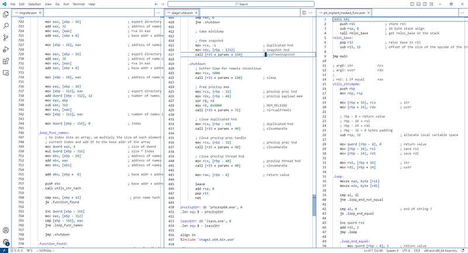

# SEXE - Small Exe

It is sequence of bytes that executes inside another program, without the bells and whistles of a full executable file, but works like one.

## Background
One look at shellcodes and it was love at first byte. They call functions from other libraries, without needing the "string" name of the function. It is done in a very self contained way. 

A small example. Normally, calling a function would require the program to get the address of the memory location where the function is loaded to. This means calling `GetProcAddress` function on Windows, which takes in a `string` parameter as the name of the function. The `string` is stored in the executable as human readabable form in the `.data` segment, and can be picked up by security systems.

Shellcodes get around this by generating the required funcion name `string` at runtime, primarily by decrypting data, getting the process address of the function and calling the function.

The Portable Executable ([PE](https://learn.microsoft.com/en-us/windows/win32/debug/pe-format)) format for Windows, is the format of a executable file, and it stores different types of data in different sections throughout the file.

| Section | Type of Data     |
|---------|------------------|
| .text   | executable code  |
| .data   | literal data used by the code    |
| .rodata | literal readonly data used by the code   |
| .reloc  | a table that tells the OS where to fetch the data and imported function from at runtime    |

Of the above our code ideally span only the `.text` section, to prevent early detection of the intent of the code.

## Roadblocks
The attemps were to get a higher level language compiled down to just the `.text` section in the executable. C was used as the higher level language.

### First
Started with a typical C program.
```
#include <stdio.h>

int g_age = 30;                     // needs a entry in the reloc table

int main (void)
{
  char *name= "Dude";               // needs a .data section where this string is stored, 
                                    // which then needs an entry in the .reloc section
  printf("%s: %d\n", name, g_age);  // imported from vcruntime.lib, needs resolving before execution
  return 0;
}
```
This will not be useful.

### Second
To make the code self reliant we store the data on the stack.
```
#include <stdio.h>

int main(void)
{
  int age = 30;                           // stored on the stack
  char name[] = {'D', 'u', 'd', 'e', 0};  // this is created by storing a sequence of chars
  printf("%s: %d\n", name, age);          // imported from vcruntime.lib, needs resolving before execution
  return 0;
}
```
The `age` and `name` work fine but use of the imported `printf` function makes this not useful.

### Third
Recreate the required C-runtime functionalities, e.g. `memset`, `memcpy` etc etc, so they can be inlined wherever needed. 

However, File I/O and Console I/O functions would have to be resolved by our code at runtime. It was my motive to make this resolved functions (addresses) to be available to all the functions at any time. Ideally I/O should happen through one function, but yeah.

The resolved addresses needed to be stored somewhere to be available to all the functions.

Global variables could not be used. So the functions were resolved wherever they were required. However the code would have to be compiled with optimizations turned off (`/Od`). Using `/O2` or `/Ox` would move the compiled code and create a `.data` section, for more optimized code (duh!)

The [c_utils](http://www.github.com/nihalkenkre/c_utils) project provides wrappers around the Win32 APIs which were required during execution. This project uses that library to insert a hook into and older version of `Veracrypt` app to steal the password, during volume mount. [This](http://www.github.com/nihalkenkre/mda_project) project uses the library to write to standard output.

### Fourth
There was a need to have data generated by one function available to the entire program. The functions may be called at any time and would need that data. 

A rootkit “hide” functionality would need to know the process names after another function has updated the list of names.

Using global variables was not an option. 

## Custom PE Loader and ASLR
The Windows PE loader, when an exe is executed, loads the exe file into memory, and resolves everything that is required by the `.text` section. This includes resolving addresses to relocated data, addresses to imported functions. And then it jumps to the memory location of the `.text` section, which runs the code.

Ideally, if only there was a PE loader which would load the `exe` file into another process and do the resolving at runtime, any regular `exe` would work like a self contained shell code. 

But there was one more thing, or I thought there was. Address Space Layout Randomization (ASLR). ASLR randomizes the address where a `exe` or a `dll` is loaded in memory. This makes it a bit difficult to get to the system functions (in `kernel32.dll` or `ntdll.dll`), since now the addresses of the functions are not known.

I assumed the ASLR worked for every process uniquely, so `kernel32.dll` would be loaded at a different virtual address for `notepad.exe` and at a different virtual address for `my_awesome_app.exe`. This was going to make the PE loader look for the `kernel32.dll` for every process it was injected into, and then resolve the functions from there.

Luckily, during one of the video lessons, the instructor from Sektor7 did a GetProcAddress in the host process and passed it on to the target process where it would be executed.

I asked him about it and he said ASLR works on reboots, so any DLL is loaded into memory and it is available at the same Virtual Address across all the processes. I clearly over estimated ASLR, or did not know how it worked. HAHA!!

So e.g. the `kernel32.dll` loaded at a particular address would be available at that same address until the machine is restarted. This was convenient.

## S-exe
What if there was a way for the shellcode to know what location it was executing from. That way different types of data could be stored together in one chunk. And it would know exactly what data is where relative to its starting address. And all of this data would be in the `.text` section itself.

The addresses of the various functions could be got from either from the injector or from the shellcode itself, and stored in the addresses reserved for the 'data', along with other globally accessed data and the shellcode is good to go.

This behaves like an exe with the resolved function addresses available and the global data accessible, it is called `s-exe`.

Borrowing from the [toy OS](http://www.github.com/nihalkenkre/emu_os) project I worked on, the bootloader uses the `ORG` directive of NASM to set the origin of the exe and the labels in the `asm` source are basically offset from that value.

`NASM` has a `-f bin` which outputs the raw binary of the assembly file.

Using a bit of `call/pop` magic and we can calculate the `base` address of the code and store it in a non volatile register. Using a non volatile register ensures the the value is available till the end of the execution.

A typical sexe source file will look like this for 64 bit
```
;
; 64 Bit sexe
;

[bits 64]
  push r15                          ; saves the non volatile reg
  sub rsp, 8                        ; 16 byte stack align
call reloc_base
reloc_base:
  pop r15                           ; address of reloc_base label in r15
  sub r15, 11                       ; r15 contains the starting address of the code

jmp main

other_function:
    push rbp
    mov rbp, rsp

    mov rcx, r15
    add rcx, data
    add rcx, 8                      ; passing the parameter as a pointer
    call [r15 + data + 16]          ; calling some function 

    mov rcx, [r15 + data + 24]      ; passing 'global' data by value
    call [r15 + data + 32]

    leave
    ret

main:
  push rbp
  mov rbp, rsp

; execute code
; call other functions as you normally would

  sub rsp, 32                       ; shadow space
  call other_function

  leave                             ; standard frame pointer reversal
  add rsp, 8                        ; undo the sub rsp, 8 from line 3
  pop r15                           ; undo the push r15 from line 2
  ret                               ; return the flow to where it came from

align 16
data:
; global data follows here
; and is accessed like so
; r15 + data + n = access data stored at n bytes from data label
```

and for 32 bit

```
;
; 32 bit
;

[bits 32]
    push esi                        ; saves the non volatile register
    call reloc_base    
reloc_base:
    pop esi                         ; address of reloc_base label in esi
    sub esi, 6                      ; esi contains the starting address of the code

jmp main

other_function:
    push ebp
    mov ebp, esp

    mov eax, esi
    add eax, data
    add eax, 8
    push eax                        ; passing the parameter as a pointer
    call [esi + data + 12]          ; call some function

    push dword [esi + data + 4]     ; pass 'global' data by value
    call [esi + data + 16]          ; call some function

    leave
    ret

main:
  push ebp
  mov ebp, esp

  ; execute code
  ; call other functions as you normally would

  call other_function

  leave
  pop esi
  ret

data:
; global data follows here
; and is accessed like so
; esi + data + n - access data stored at n bytes from data label
```

The compiled code can be stored in a Executable memory can be passed to RtlRemoteCall or CreateRemoteThread to be executed.

This ‘global’ data can be updated by the S-exe or by the parent code.

Projects using this technique

[Remote Call Demo](http://www.github.com/nihalkenkre/remote_call)  
[Malware Development Intermediate Project](http://www.github.com/nihalkenkre/mdi_project/tree/master/with_sexe)  
[Malware Development Advanced Vol. 1 Project](http://www.github.com/nihalkenkre/mda_project)  
[Userland Rootkit](http://www.github.com/nihalkenkre/UserlandRootkit)

## Benefits
The sexe code is very small since it is compiled as raw binary from the source nasm file.

It does not need any special setup, in terms of loaders, or parameters to be passed to the thread creation functions.

Since the data access is direct memory access through assembly, the code and data parts of the binary can be allocated as two different memory regions if needed with different permissions to blend in.

It is less clunky that the loading COFF files. The address of external functions are resolved by the loader and copied to the memory along with the sexe code, which is then accessed as shown above

The COFF files require the functions to be named in a particular format the loader to recognize them and load the appropriate DLLs and get the function addresses and fill the Address table.

Also, the COFF files have a lot more data than sexe files, which needs to be sifted through, there by making the loader more involved as well, as compared to the sexe loader.